[[pdf]](http://tiankuizhang.github.io/files/00Thesis/TiankuiZhangThesis.pdf)

## Abstract
Cell membranes are crucial to the life of cells and vesicles are important model systems for cell membranes. In this thesis, we aim to understand shape transformation of vesicles with theoretical tools from differential geometry and numerical techniques within the framework of the level set method.

Shape dynamics of vesicles has been investigated for many years since Helfrich proposed the famous quadratic curvature energy to explain shape of red blood cells in the 1970s. The Helfrich Hamiltonian ignores lateral inhomogeneity of the vesicle and higher order curvature energy terms. Therefore most researches taking the Helfrich model for granted ignores tangential dynamics and elastic forces for higher order terms. Recently,  a more general Hamiltonian that includes all curvature scalars up to fourth order was proposed by Deserno. Our first job is to calculate all of the variations for this much more general Hamiltonian, which will prove useful for vesicle models beyond the Helfrich model. Inspired by the general Hamiltonian from Deserno, a general line energy is proposed in the thesis by the argument of symmetry. We then proceed to calculate all of the variations for the curvature scalar of curves. This yield very useful results for vesicles models with phase coexistence, open edges etc. 

Numerical simulations also dates back to Helfrich's first paper. There are two approaches to the numerical simulation of vesicles in three dimensional space. In the first approach, a connected mesh is used to represent the surface. There two major difficulties with this methodology. The first arises when topological changes such as pinching off and fusion happen, which is fairly common for real biomembranes. The mesh needs to be separated or sewn together which can be quite involved. The other difficulty lie in the computation of surface geometries such as curvature and surface Laplacian of curvatures. The accuracy of the computation of such kind depends heavily on the quality of the mesh which is hard to maintain during larger deformations The other approach represents the surface implicitly as the level sets of a higher dimensional function defined on a Eulerian grid. Notable examples are the phase field method and the level set method. The phase field method is a diffusive boundary method where the boundary is represented by a narrow band of grids. One of the drawback is that there are no straightforward techinques for converting arbitrary surface integral of surface and curve curvature scalars into the phase field model. Complicated mathematical proofs are needed to establish the equivalent between the phase field model and the sharp interface models. The level set method is a sharp interface method and it is easy to represent geometries with the level set method. We therefore choose the level set method as the numerical framework for our simulation. One major problem of the level set is the requirement for reinitialization which introduces errors every time the level set function is restored. To maintain accuracy of the level set function, we developed a sixth order accurate scheme for the reinitialization equation, which can also be used to solve Hamiltonian-Jacobi equations with level set-defined boundary conditions. This scheme is also useful for other science and engineering problem with implicit surfaces.

We developed a massively parallel three dimensional scheme for the simulation of single phase vesicles, biphasic vesicles. By utilizing the power of GPU and using an implicit scheme, we can simulate vesicle dynamics on a longer time scale and observe some new results. In particular, we investigated the effects of reduced volume, spontaneous curvature, osmotic pressure, constraints on the reduced area difference for the dynamics of single phase vesicles. Pinching of vesicles into multiple smaller ones are handled without a problem. Some experimental observations are successfully reproduced. For biphasic vesicles, we explored effects of line tension, reduced volume, spontaneous curvature for pinching off of bidomain vesicles. We also developed a scheme to enforce local area incompressibility and regularization of the auxiliary level set function representing phase boundaries. Phase coarsening with shape dynamics of vesicles, internal and outside budding of multidomain vesicles are simulated. As last, we developed a simple model for protein membrane interaction. The elastic force density between protein molecules and biomembranes is computed. We showed examples of protein density dynamics on a static curved surface when different models for bending moduli and spontaneous curvature area used. Examples of protein kinetics on dynamic single phase and biphasic vesicles are shown. We find that pinching of biphasic vesicles under effects of curvature sensing and curvature inducing molecules can happen near or away from the phase boundary by varying parameters of the model. We hope our result will help understand shaped dynamics of vesicles and how various physical conditions can influence this process.

## Computation of Geodesics on the Stanford Bunny

## 3D simulation of  Single Phase Vesicles

### relaxation of an oblate and a prolate
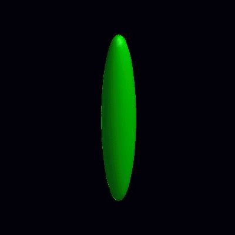

### pinching of an oblate and a prolate under the effect of spontaneous curvature
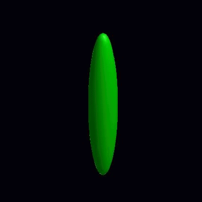

### deformation of vesicles under effects of osmotic pressure and constrained reduced area difference
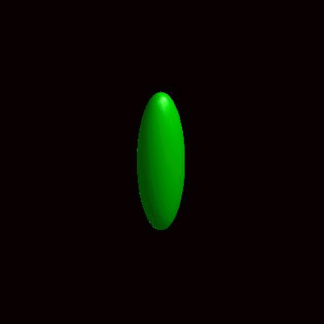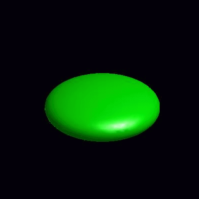

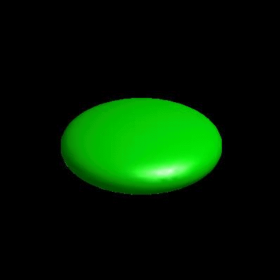

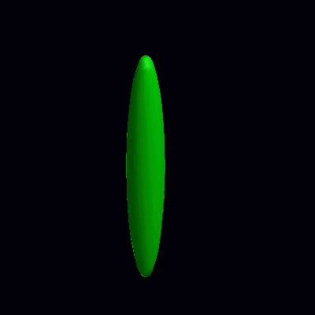

## 3D simulation of  BiPhasic Vesicles

### bidomain biphasic vesicles with different ratio of area for different phases

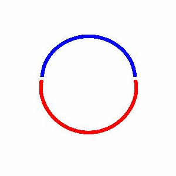

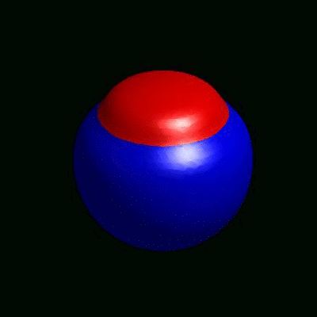

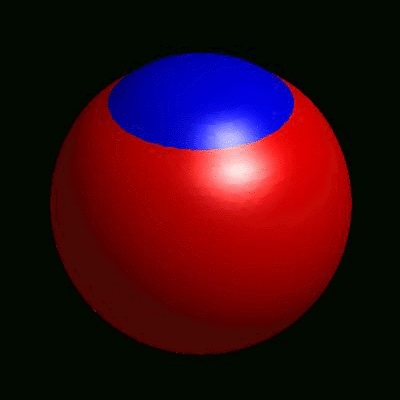

### domain coarsening under the effect of line tension

### incompressible vs compressible vesicles

### external and internal budding of vesicles
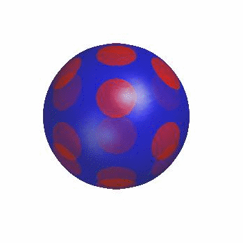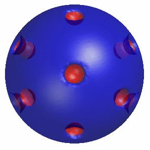

## Vesicle Shape Dynamics coupled with Protein Kinetics
### redistribution of proteins due to dependence of spontaneous curvature and bending moduli on the presence of protein molecules

### pinching of single phase and biphasic vesicles in the presence of protein molecules

