<b>Tiankui Zhang</b> and Charles W Wolgemuth

[[pdf]](http://tiankuizhang.github.io/files/10paper/zhang2021general.pdf)

## Abstract
The dynamics of thin, membrane-like structures are unbiquitous in nature. They play especially important roles in cell biology. Cell membranes separate the inside of a cell from the outside, and vesicles compartmentalize proteins into functional microregions, such as the lysosome. Proteins and/or lipid molecules also aggregate and deform membranes to carry out cellular functions. For example, some viral particles can induce the membrane to invaginate and form an endocytic vesicle that pulls the virus into the cell. While the physics of membranes has been extensively studied since the pioneering work of Helfrich in the 1970's, simulating the dynamics of large scale deformations remains challenging, especially for cases where the membrane composition is spatially heterogeneous. Here, we develop a general computational framework to simulate the overdamped dynamics of membranes and vesicles. We start by considering a membrane with an energy that is a generalized functional of the shape invariants and also includes line discontinuities that arise due to phase boundaries. Using this energy, we derive the internal restoring forces and construct a level set-based algorithm that can stably simulate the large-scale dynamics of these generalized membranes, including scenarios that lead to membrane fission. This method is applied to solve for shapes of single-phase vesicles using a range of reduced volumes, reduced area differences, and preferred curvatures. Our results match well the experimentally measured shapes of corresponding vesicles. The method is then applied to explore the dynamics of multiphase vesicles, predicting equilibrium shapes and conditions that lead to fission near phase boundaries.

## 3D simulation of  Single Phase Vesicles

### relaxation of an oblate and a prolate
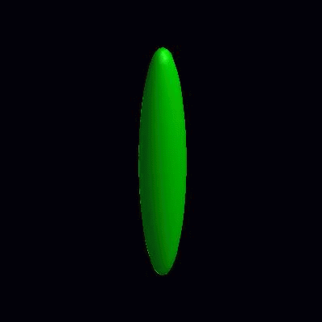

### pinching of an oblate and a prolate under the effect of spontaneous curvature
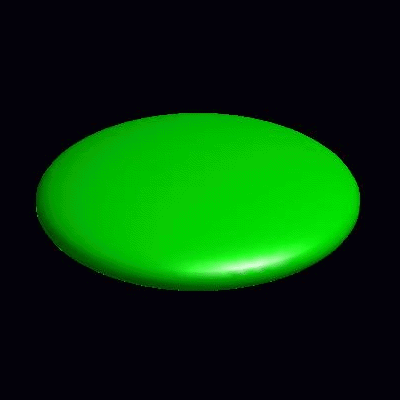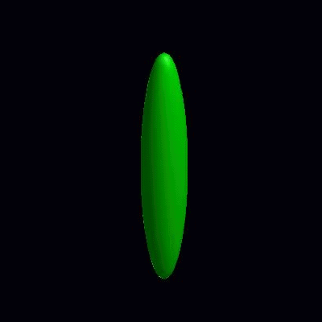

### deformation of vesicles under effects of osmotic pressure and constrained reduced area difference
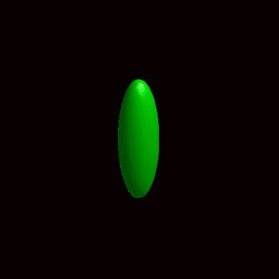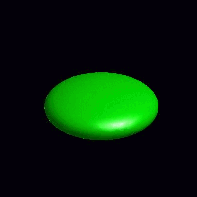

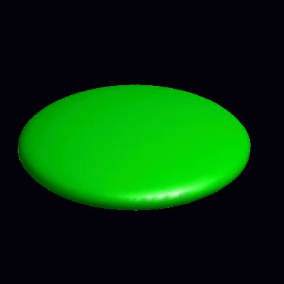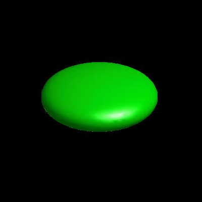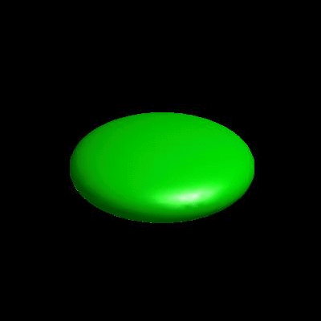

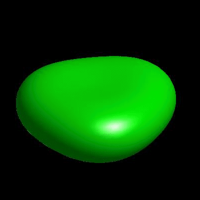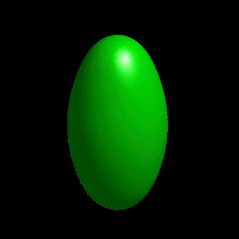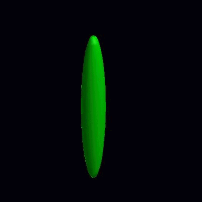

## 3D simulation of  BiPhasic Vesicles

### bidomain biphasic vesicles with different ratio of area for different phases

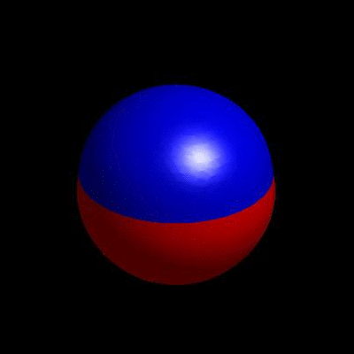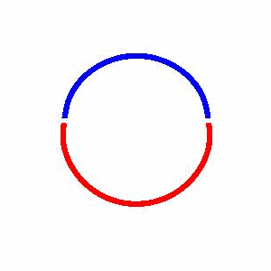

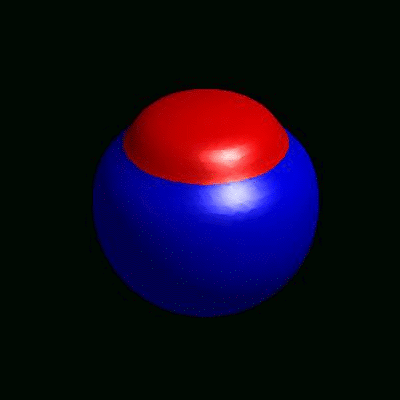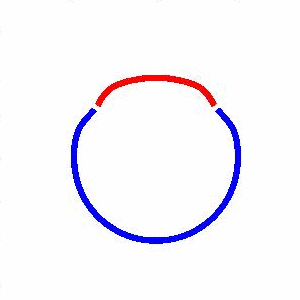

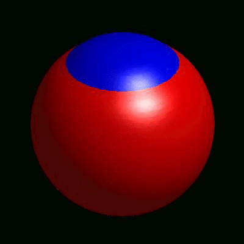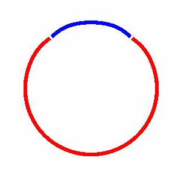

### domain coarsening under the effect of line tension

### incompressible vs compressible vesicles
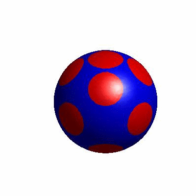

### external and internal budding of vesicles
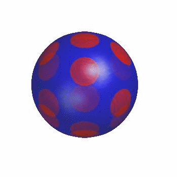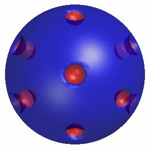
